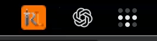

# Menu Bar Attention

Menu Bar Attention is a RuneLite plugin for macOS. When RuneLite fires a
notification in the background, its menu-bar icon blinks orange until you
genuinely resume gameplay.



Opening or focusing RuneLite does not dismiss the indicator. It clears when
your character:

- moves to a different world tile;
- starts a new animation; or
- starts a new interaction with another actor.

Logging out or disabling the plugin restores the normal icon immediately. The
plugin observes RuneLite state and updates the menu-bar icon; it does not
automate or inject game input.

## Install

1. Open RuneLite's configuration panel.
2. Select **Plugin Hub**.
3. Search for **Menu Bar Attention** and select **Install**.

The plugin uses RuneLite's existing menu-bar icon when available. If RuneLite
has not created one, the plugin creates a clickable RuneLite icon itself.

## Settings

- **Attention color** changes the indicator color.
- **Blink** controls whether the normal and attention icons alternate.
- **Blink interval** controls the speed of that animation.
- **Force focus after** brings RuneLite forward once after the indicator has
  remained unresolved for the selected number of minutes. `0` disables it.
- **Responsive menu-bar click** enables immediate, flicker-free click handling
  on macOS. It is off by default and temporarily replaces RuneLite's existing
  click handler only while enabled.
- **Alert while focused** also shows the indicator for notifications fired
  while RuneLite is already focused.

Only a gameplay action clears an active indicator. Force focus and responsive
menu-bar clicks bring RuneLite forward without clearing it.

## Development

This repository follows RuneLite's standard external-plugin development flow
and requires Java 11.

```shell
./gradlew test
./gradlew run
```

For a Jagex Account, follow RuneLite's
[development-client login instructions](https://github.com/runelite/runelite/wiki/Using-Jagex-Accounts).

The responsive-click workaround tracks a
[RuneLite core fix](https://github.com/runelite/runelite/pull/20506). Once that
fix is released, normal RuneLite click handling will provide the same behavior.

## License

BSD 2-Clause. See [LICENSE](LICENSE).
